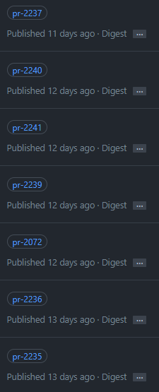

# Image Cleaner Action

This repository contains two actions for solving problems with the GitHub Container Registry.

These

## Ephemeral Image Removal

Many actions in a repository will end up creating a Docker image stored on the GitHub Container Registry
(ghcr.io). This is quite useful, as another developer can pull the image to test your code or a
user can confirm the fix worked as expected. The image may be built on each push to a certain named branch or
when a pull request is created or updated.

But what about after the fix has been made, the feature tested or the pull request merged? Do you really
need to keep the Docker image around, accessible and cluttering up your packages? That makes it harder for a
user to locate the last released tags. If you're paying for the storage space, each image takes up some
amount of storage as well.

You end up with a situation like this:

That's the problem this action attempts to solve. This action aims to simplify the cleaning of containers
which are meant to be ephemeral. Once their job is completed, they don't need to exist in the registry.

This action correlates an image to its source, either a branch or a pull request. If the branch is
deleted or the pull request has closed, the image is un-versioned using the REST API.

This action plays nicely with the untagged cleaner, as un-versioning doesn't remove the actual image.

### Features

- Safe by default: only takes action after you directly tell it to
- Verbose: Every action taken is logged, including with enough information to restore a deletion
- Flexible: handles branch based or PR based naming

### Usage

For details on using the action, see [the README for the action](./untagged/README.md)

## Untagged Images Cleanup

When a new image is built, tagged and pushed to replace an existing tag, the original
image doesn't get removed from the registry.

You end up with a situation like this:

These untagged images are still accessible using the `sha256:` digest of the image as a tag,
but most people are never using such tags. And the long lived tags, such as your releases
will always remain accessible via the `sha256:`

It's not directly a problem, but it is untidy. If you're paying for the storage space, each
image takes up some amount of storage as well. In an ideal world, there would be a retention
policy or reaper configuration to easily remove images based on some configuration. But as
of now, GitHub doesn't provide such tools.

This action therefore handles deleting the untagged package versions using the REST API.

### Features

- Safe by default: only takes action after you directly tell it to
- Verbose: Every action taken is logged, including with enough information to restore a deletion
- Handles multi-architecture and regular images, even mixed in the same package
- Handles packages owned by an organization or a user

### Usage

For details on using the action, see [the README for the action](./ephemeral/README.md)
