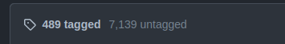

# Untagged Image Cleaner Action

## The Problem

When you build, tag and push a new image to the GHCR, have you ever wondered what happened to the
old one? Well, it still exists in the registry, only not accessible via the nicer naming scheme of
tags.

That leads to a packages view looking like this:

It's a cluttered look and takes up storage for images you don't really want or need
to access again. If you're paying for storage, it's extra space being taken for
these images too.

## The Solution

This actions aims to simplify the cleaning of containers which are untagged from the GitHub
Container Registry.

## Features

- Correct handling of multi-arch manifests and single arch images (even in the same package)
- After cleaning, verifies the remaining tags are still valid
- Clear logging about what was removed, included the necessary information to restore if necessary
- Dry-run by default. You have to really ask to delete the images before any changes are made
- Handles rate limiting
- Doesn't pull the full image, instead inspecting the image in the registry
- Under the hood caching of dependencies for faster action running (if actions/toolkit/issues/1035 is resolved)

## Why my own API wrapper?

Well, looking at the existing Python API wrappers, there were either bugs or no support for the packages
endpoint. As this needs only a subset of the endpoints anyway, it's easier to just parse the JSON myself.
The API is versioned, so this should be a stable response
